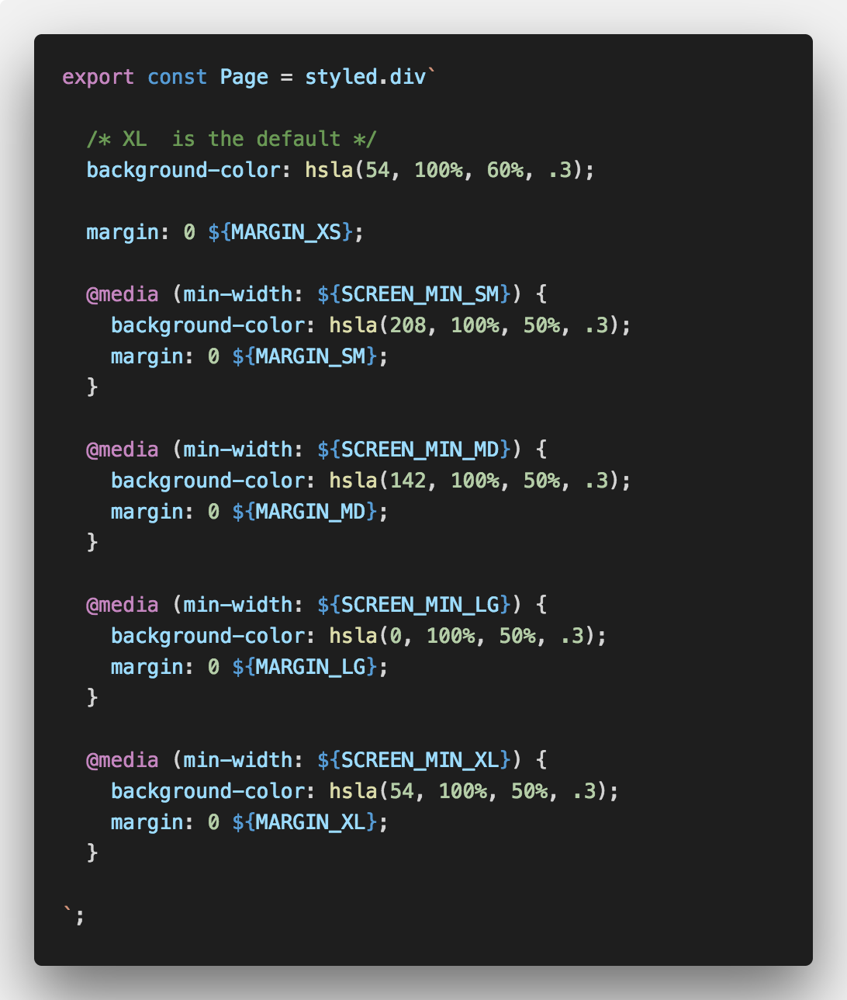

# Design-System-Variables

https://thierryc.github.io/Design-System-Variables

Variables Design System for Grid, Layout, Media Queries, Responsive Design, Typography Rhythm and colors.
A “ready to use” set of variables for Design System.

### Typography drived variables for CSS in JS.

Spacer is 1/3 or 2/3 of the (paragraphe) line heights. 

Margins and gutters are also based on the (paragraphe) line height.

## Accessibility

### Colors 

## styled-components



# Masters Variables:

## Typography 

* Font Family (Heading and Body)
* Line height

## Rhythm Scale

* Rhythm (FIBONACCI)

# Colors

Color object have accessibility data. 

'DisplayColor' is the color for the text on it. 
It can be black or white. 

```js

"contrastBlack": "7.16",
"contrastWhite": "2.93",
"displayColor": "black",
"accessibility": {
    "aa": true,
    "aaLarge": true,
    "aaa": true,
    "aaaLarge": true
}

```

## Background Colors

## Main Colors

* Blue Hue
* Green Hue
* Yellow Hue
* Red Hue

# Variables:

## Typography

* 1 heading font (Lora serif font)
* 1 body font (Nato sans serif font)
* 1 code font 

## Colors 

* 4 brand colors
* 4 messages colors (success, warning, danger, info)
* 10 other color
* and useful colors like twitter and Facebook

## Grid

The grid is 1/3 of the lineHeight. (~ 8px)

# Layout, Columns, gutters, and margins

## Columns

Content is placed in the areas of the screen that contain columns. 
Column width is defined using percentages.

* COL_NUMB_SX = 4;
* COL_NUMB_SM = 4;
* COL_NUMB_MD = 8;
* COL_NUMB_LG = 12;
* COL_NUMB_XL = 12;

## Gutters

Gutters are the spaces between columns. They help separate content. 
Gutter widths are fixed values at each breakpoint range.

* GUTTER_SX = 1 * grid (~8px)
* GUTTER_SM = 1 * grid (~8px)
* GUTTER_MD = 2 * grid (~16px)
* GUTTER_LG = 3 * grid (~24px)
* GUTTER_XL = 3 * grid (~24px)

## Margins

Margins are the space between content and the left and right edges of the screen.

* MARGIN_SX = 2 * grid (~16px)
* MARGIN_SM = 2 * grid (~16px)
* MARGIN_MD = 3 * grid (~24px)
* MARGIN_LG = 4 * grid (~24px)
* MARGIN_XL = 4 * grid (~32px)

## How to use


# Variables list


# Create your onw set


# Get Cap height of a font

Video Sketch soon

https://github.com/sebdesign/cap-height


